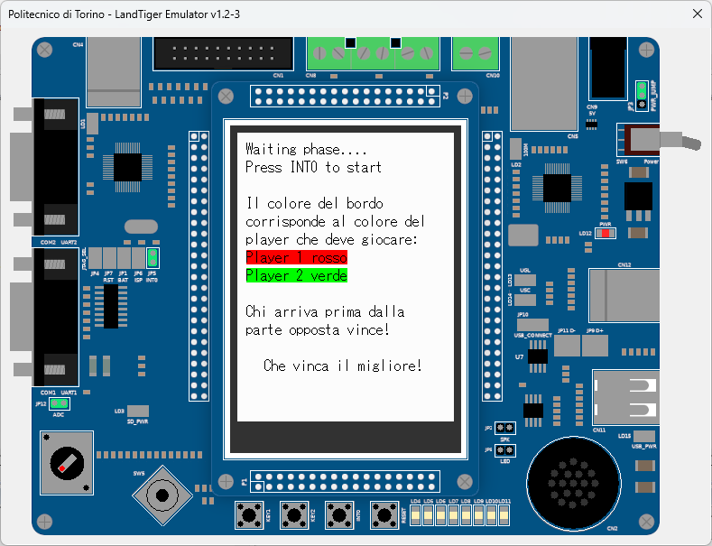
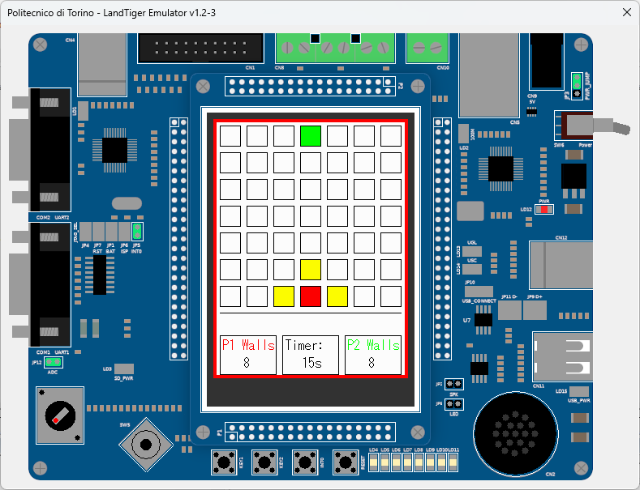
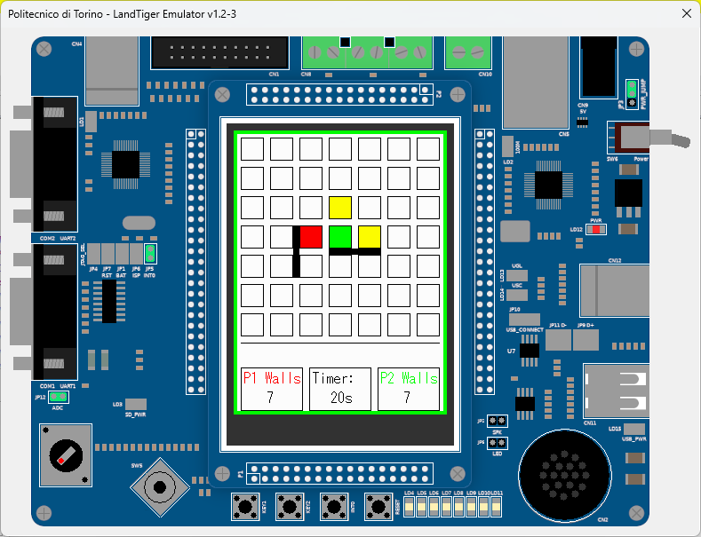
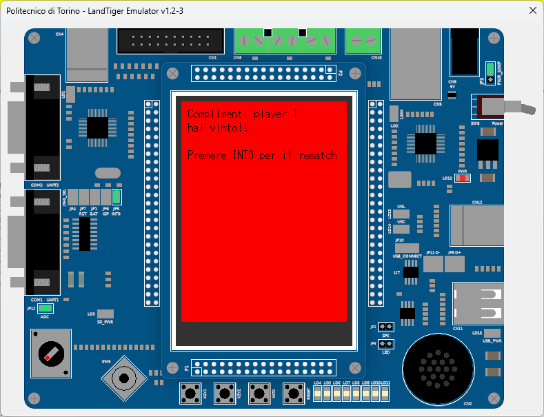

# Quoridor - Game Rules
Project for the course _"Architetture dei sistemi di elaborazione"_ at _Politecnico di Torino_
## 🎲 Overview  
Quoridor is a strategy board game for 2 players. Each player controls a token and has 8 barriers. The goal is to reach the opposite side of the board before the opponent.

## 📜 Rules of the Game  

### 🏁 Objective  
Each player starts from the center of their perimeter line (4th square) and must reach the opposite perimeter line first to win.

### 🔄 Turn Mechanics  
On their turn, a player must choose **one** of the following actions:  
1. **Move their token** horizontally or vertically to an adjacent square.  
2. **Place a wall** on the board to block the opponent's path.  

### 🚧 Walls & Movement  
- Walls cannot be jumped over but must be navigated around.  
- If two tokens face each other without a barrier in between, the active player **can jump over the opponent**.  
- It is **not allowed to trap** an opponent completely; a path to their goal must always remain open.  

### ⏳ Time Limit  
Each player has **20 seconds per move**. If they fail to move within the time limit, they lose their turn.

## 🏆 Winning Condition  
The first player to reach the opposite perimeter line wins the game.  

---

Enjoy playing Quoridor! 🎉  

## 📸 Screenshots 

## Home screen

## Start of the game

## Wall placement

## Victory screen

## Known limitations
Unfortunatelly the application runs really poorly on the debugger, but it has no problem with the actual board as you can see from the video.

[Video of the real board (in italian)](https://drive.google.com/file/d/1lPzKHBegTp0OaUKRqONHmouG65DGNGvD/view?usp=sharing)
